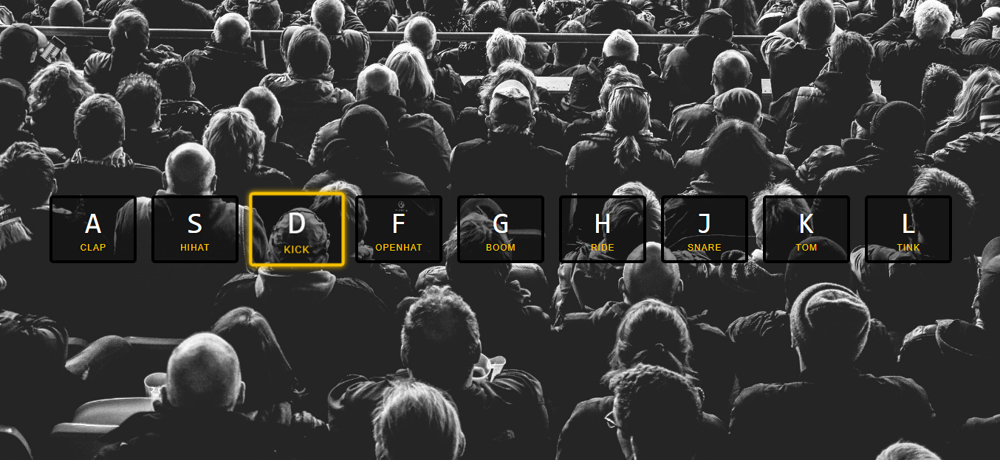

## About
Turn your keyboard into a mini drumkit.

[Try the live demo.](https://rawgit.com/StephanieCunnane/javascript30/master/01%20-%20JavaScript%20Drum%20Kit/index.html)

#### Resource
[keycode.info](http://keycode.info/) was helpful in implementing this project. Press a key on your keyboard and see its keycode. Incredibly simple UI and exactly what you need to know.
