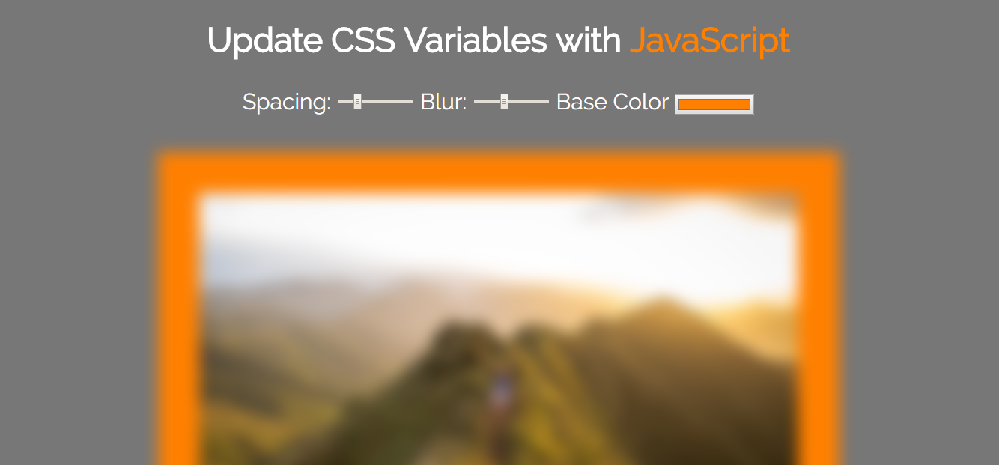

## About
A simple example of using JavaScript to dynamically change the values of CSS variables

[Try the live demo.](https://cdn.rawgit.com/StephanieCunnane/javascript30/350d2205/03%20-%20CSS%20Variables/index.html)
