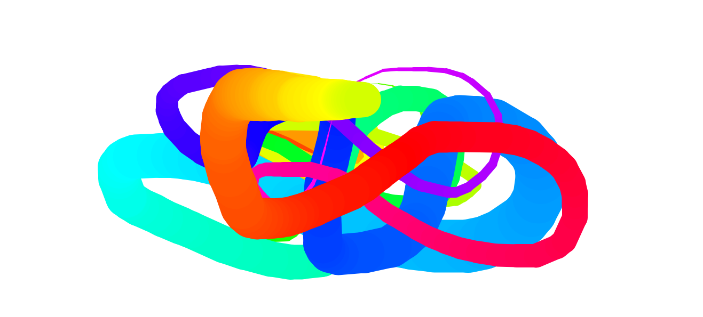

## About
A simple demo of drawing on an HTML5 2D \<canvas\> element. The canvas is set to the viewport size, so just click anywhere in the viewport to start drawing.

[Try the live demo.](https://rawgit.com/StephanieCunnane/javascript30/master/08%20-%20HTML5%20Canvas%20Demo/index.html)
