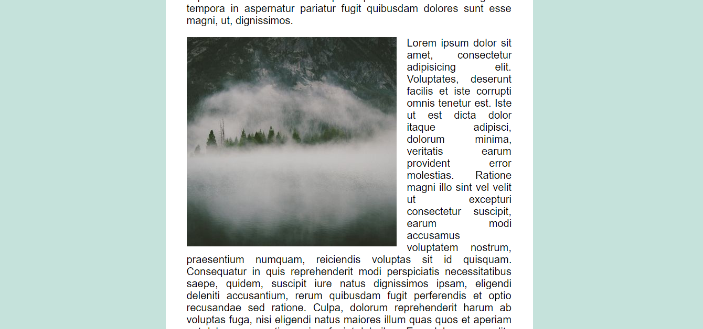

## About
A page layout in which images slide in from the side as you scroll down the page. Not necessarily a technique to use in production, but a quite useful learning exercise.

[See the live demo.](https://rawgit.com/StephanieCunnane/javascript30/master/13%20-%20Slide%20in%20on%20Scroll/index.html)
