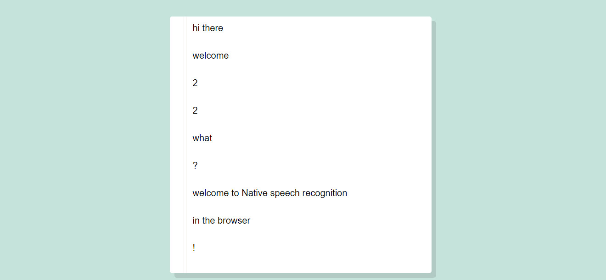

## About
A simple example of native speech recognition in the browser, using the Web Speech API

[Try the live demo.](https://rawgit.com/StephanieCunnane/javascript30/master/20%20-%20Speech%20Detection%20in%20the%20Browser/index.html) (You'll need to be running a local server for this to work.)
